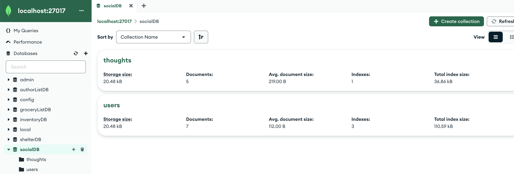
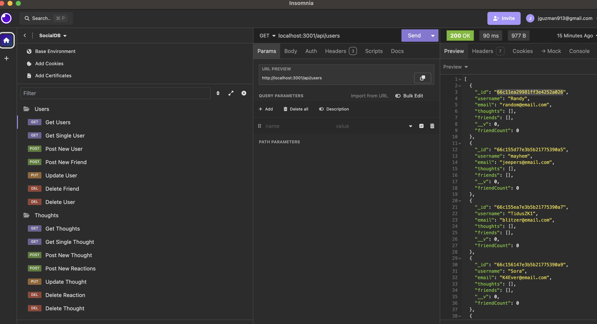

# Social-Network-API

## Table of Contents
- [Description](#description) 
- [Installation](#installation)
- [Usage](#usage)
- [Contributing](#contributing)
- [Test](#test)
- [Contact](#contact)
 

  ## Description

  The purpose of this project isto build an API for a social network web application where users can share their thoughts, react to friends’ thoughts, and create a friend list.

  

  

  

  video link:  https://vimeo.com/1000079837/778326d9ce

  ## Installation

  To install, clone Github repository and install on local machine.
  
  ## Usage

  The technologies used were Express.js for routing, a MongoDB database, and the Mongoose ODM.

  ## Contributing
  Jorge Guzman

  ## Test
  Insomnia was used to test the api routes on the backend. 
  
  ## Contact
  Email: jguzman913@gmail.com

  Github: https://github.com/JGuzman87

